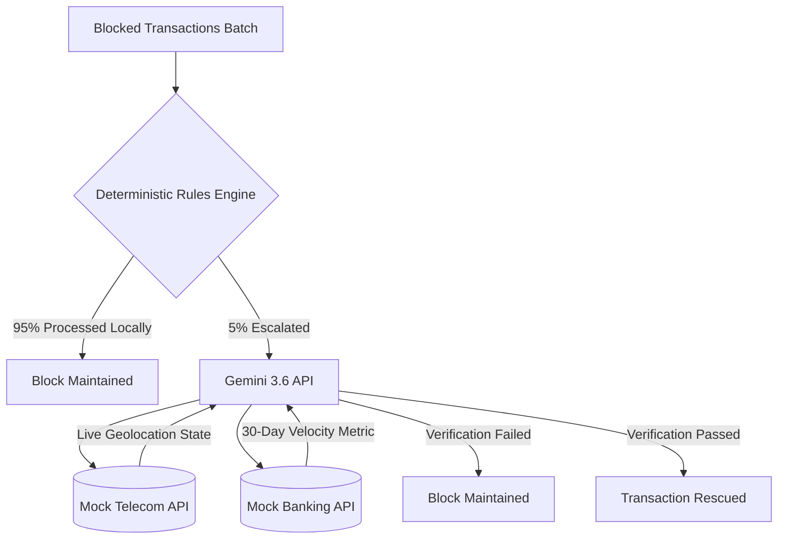

# Razorpay Risk Command Center

A multi-stage validation pipeline designed to intercept and re-evaluate false-positive fraud blocks using deterministic logic and LLM-based API triangulation.

## System Architecture

The pipeline processes blocked transactions downstream of the primary fraud model. To optimize API costs and latency, the system utilizes a cascading validation architecture rather than routing all data to an LLM.

### 1. Deterministic Filtering Layer
Ingests bulk transaction data (`pandas.DataFrame`) and applies strict local logic gates. Transactions matching high-confidence fraud signatures (95% of the payload) are maintained as blocked. Only highly ambiguous edge cases are escalated.

### 2. Multi-Modal API Triangulation
Escalated transactions (5%) are routed to the `gemini-3.6-flash` model. The agent is strictly constrained to authorize rescues based on cross-referenced external data:
* **Telecom Node:** Verifies if the checkout IP address matches the device's live cellular roaming state.
* **Open Banking Node:** Evaluates 30-day account transaction velocity to ensure legitimate financial history.

### 3. Execution Engine & Rate Limiting
The engine orchestrates API calls while managing upstream rate limits. It implements a synchronous delay mechanism (`time.sleep`) specifically calibrated to handle the Google Gemini API free-tier limit of 5 requests per minute, ensuring no data is dropped during bulk holdout testing.

## Technology Stack

* **Core Pipeline:** Python 3.9, Pandas
* **AI Integration:** `google-genai` SDK, Gemini 3.6 Flash
* **Interface:** Streamlit (with native `.streamlit/config.toml` overrides for strict corporate UI theming)
* **Environment:** `python-dotenv` for secure API key injection

## Pipeline Flowchart



## Local Setup & Execution

### Prerequisites
Requires Python 3.9 or higher.

```bash
# Install dependencies
pip install streamlit pandas google-genai python-dotenv
```

### Environment Configuration
Create a `.env` file in the root directory to store your API credentials safely:
```bash
GEMINI_API_KEY="your_api_key_here"
```
*Note: The `.env` file is explicitly ignored in `.gitignore` to prevent secret leakage.*

### Execution
Run the pipeline interface locally:
```bash
python -m streamlit run src/app.py
```
